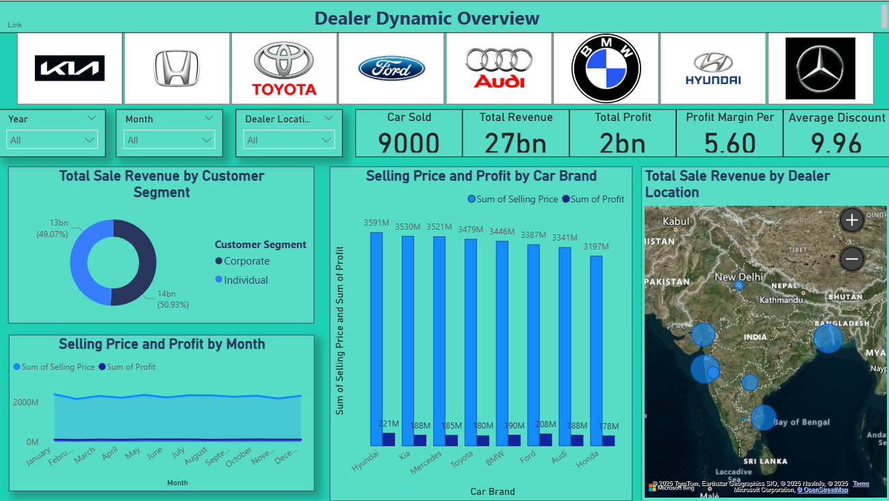

# 🚗 Car Sales Analysis Dashboard (Power BI)

This project is a **Power BI dashboard** designed to analyze **car sales performance**, profits, customer segments, and dealer insights.  
It provides a clear and interactive view of business performance across different **car brands, models, dealer locations, and salespersons**.

---

## 📊 Key Features
- **Decomposition Tree**  
  Breaks down profit contributions by customer segment, car brand, model name, dealer location, and salesperson.  
- **Dynamic Dealer Insights**  
  - Model-level performance comparison  
  - Salesperson performance table with selling price and profit  
  - Profitable heatmap by brand and location  
  - Revenue vs Profit by customer type visualization  
- **Filters Available**  
  Car Brand, Year, Month, Dealer Location, Model Name, Customer Segment  

---

## 🛠️ Tools Used
- **Power BI Desktop**
- **Dataset:** Car sales data (profit, revenue, dealers, customers, brands, models)

---

## 📂 Project Files
- `Car_Project.pbix` → Power BI report file
- `Main_Dashboard.png` → Main dashboard with insights  
- `Decomposition Tree.png` → Decomposition Tree Visualization  
- `Detailed Insight.png` → Dealer Dynamic Insight Dashboard  

---

## 📸 Dashboard Outputs

## 🔹 Main Dashboard

### 🔹 Decomposition Tree

### 🔹 Dealer Dynamic Insight

---

## 🚀 How to Use
1. Download the repository.
2. Open `Car_Project.pbix` in **Power BI Desktop**.
3. Explore the dashboard interactively with slicers & filters.

---

## 📌 Insights Gained
- Hyundai and Ford contribute the highest profits among brands.  
- Sales in **Mumbai, Ahmedabad, and Hyderabad** dominate the profit share.  
- **Sonia and Raj** are the top-performing salespersons by profit.  
- Profitability varies across dealer locations, with Hyderabad and Chennai performing strongly.  
- Corporate and Individual customers generate nearly equal revenue contributions.

---

## 📧 Contact
Created by **Kajal Kewat**  
📩 Feel free to connect for collaboration or suggestions.
